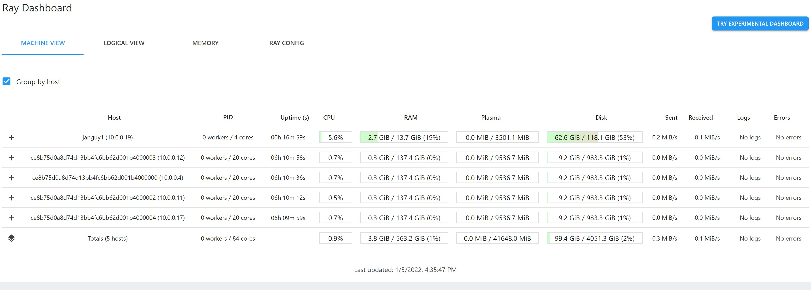

# Ray on Azure ML

NEW!

1. ray-on-aml now supports Spark from [raydp](https://github.com/oap-project/raydp) with Delta Lake, Synapse JDBC and latest pyspark 3.2.1. Checkout [spark examples](./examples/spark/spark_examples.ipynb)
2. GPU & custom base image for interactive use: if you have GPU compute cluster, then either use ray_on_aml.getRay(gpu_support=True) which internally uses mcr.microsoft.com/azureml/openmpi4.1.0-cuda11.1-cudnn8-ubuntu18.04:20211221.v1 as base image. You can supply your own base image with ray_on_aml.getRay(base_image="YOUR_OWN_BASE_IMAGE")

This package simplifies setup of core Ray and Ray's components such as Dask on Ray, Ray tune,Ray rrlib, Ray serve and Spark in Azure ML.
It also comes with supports for high performance data access to Azure data sources such as Azure Storage, Delta Lake , Synapse SQL.
It supports both interactive and job uses.

## Architecture


## Setup


### 1. Prepare Azure ML environment

For interactive mode, setup a compute cluster and a compute instance in the same VNET.

Checklist 
> [ ] Azure Machine Learning Workspace
> 
> [ ] Virtual network/Subnet
>
> [ ] Create Compute Instance in the Virtual Network
> 
> [ ] Create Compute Cluster in the same Virtual Network

### 2. Select kernel 

Use a python 3.7+ conda environment from ```(Jupyter) Notebook``` in Azure Machine Learning Studio. 
> Note: Due to Conda env issue, VSCode is only supported for remote Ray cluster mode (```getRay(ci_is_head = False```)

### 3. Install library

```bash
pip install --upgrade ray-on-aml
```
> Installing this library will also install ```ray[tune]==1.9.2,  ray[serve]==1.9.2, pyarrow>= 5.0.0, dask[complete]==2021.12.0, adlfs==2021.10.0, fsspec==2021.10.1, xgboost_ray==0.1.6, fastparquet==0.7.2```

### 4. Run ray-on-aml
Run in interactive mode in a Compute Instance notebook

```python
from ray_on_aml.core import Ray_On_AML
ws = Workspace.from_config()
ray_on_aml =Ray_On_AML(ws=ws, compute_cluster ="Name_of_Compute_Cluster", maxnode=3) 
ray = ray_on_aml.getRay() 
# may take 7 mintues or longer.Check the AML run under ray_on_aml experiment for cluster status.  
```
Note that by default,the library sets up your current compute instance as Ray head and all nodes in the remote compute cluster as workers. 
If you want to use  one of the nodes in the remote AML compute cluster as head node and the remaining are worker nodes, simply pass ```ci_is_head=False``` 
to ```ray_on_aml.getRay()```.
To install additional library, use ```additional_pip_packages``` and ```additional_conda_packages``` parameters.
The ray cluster will request 5 nodes from AML if ``maxnode`` is not specified.
```python
ray_on_aml =Ray_On_AML(ws=ws, compute_cluster ="Name_of_Compute_Cluster", additional_pip_packages= \
['torch==1.10.0', 'torchvision', 'sklearn'])
```

For use in an Azure ML job, include ray_on_aml as a pip dependency and inside your script, do this to get ray
Remember to use RunConfiguration(communicator='OpenMpi') in your AML job's ScriptRunConfig so that ray-on-aml can work correctly.

```python

from ray_on_aml.core import Ray_On_AML
ray_on_aml =Ray_On_AML()
ray = ray_on_aml.getRay()

if ray: #in the headnode
    pass
    #logic to use Ray for distributed ML training, tunning or distributed data transformation with Dask

else:
    print("in worker node")
```
### 5. Ray Dashboard
The easiest way to view Ray dashboard is using the connection from [VSCode for Azure ML](https://code.visualstudio.com/docs/datascience/azure-machine-learning). 
Open VSCode to your Compute Instance then open a terminal, type http://127.0.0.1:8265/ then ctrl+click to open the Ray Dashboard.


This trick tells VScode to forward port to your local machine without having to setup ssh port forwarding using VScode's extension on the CI.




### 6. Shutdown ray cluster

To shutdown cluster,  run following.
```python
ray_on_aml.shutdown()
```

### 7. Customize Ray version and the library's base configurations

Interactive cluster: There are two arguments in Ray_On_AML() class initilization to specify base configuration for the library with following default values.
```python
Ray_On_AML(ws=ws, compute_cluster ="Name_of_Compute_Cluster",base_conda_dep =['adlfs==2021.10.0','pip==21.3.1'],\ 
base_pip_dep = ['ray[tune]==1.9.2','ray[rllib]==1.9.2','ray[serve]==1.9.2', 'xgboost_ray==0.1.6', 'dask==2021.12.0',\
'pyarrow >= 5.0.0','fsspec==2021.10.1','fastparquet==0.7.2','tabulate==0.8.9'])
```
You can change ray and other libraries versions. Do this with extreme care as it may result in conflicts impacting intended features of the package. 
If you change ray version here, you will need to manually re-install the ray library at the compute instance to match with the custom version of the cluster in case the compute instance is the head node.
AML Job cluster: If you need to customize your ray version, you can do so by adding ray dependency after ray-on-aml. The reason is ray-on-aml comes with some recent ray version. It needs to be overidden. For example if you need ray 0.8.7, you can do like following in your job's env.yml file
```python
      - ray-on-aml==0.0.7
      - ray[rllib,tune,serve]==0.8.7
```
Check out [RLlib example with customized ray version](./examples/rl/rl_main.ipynb) to learn more 
## 8. Quick start examples
Check out [quick start examples](./examples/quick_use_cases.ipynb) to learn more 

<<<<<<< HEAD
=======
# Repository setup required :wave:
      
Please visit the website URL :point_right: for this repository to complete the setup of this repository and configure access controls.
>>>>>>> microsoft/main
=======
>>>>>>> 9a4416297a9115746a668b9ddfcc24ed059164c9
