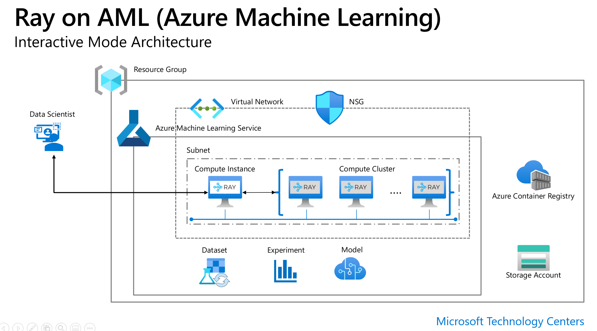

# Ray on Azure ML

This package simplifies setup of Ray and Ray's components such as DaskOnRay, SparkOnRay, Ray Machine Learning in Azure ML for your data science projects.

## Architecture



## Prerequistes

Before you run sample, please check followings.

### 1. Configure Azure Environment

For Interactive use at your compute instance, create a compute cluster in the same vnet where your compute instance is, then run this to get handle to the ray cluster

Check list
> [ ] Azure Machine Learning Workspace
> 
> [ ] Virtual network/Subnet
>
> [ ] Create Compute Instance in the Virtual Network
> 
> [ ] Create Compute Cluster in the same Virtual Network

### 2. Select kernel 

Use ```azureml_py38``` from ```(Jupyter) Notebook``` in Azure Machine Learning Studio to run following examples. 
> Note: VSCode is not supported yet.


### 3. Install library

To install ray-on-aml 
```bash
pip install --upgrade ray-on-aml
```


### 4. Run ray-on-aml
Run in interactive mode in compute instance's notebook

```python
from ray_on_aml.core import Ray_On_AML
ray_on_aml =Ray_On_AML(ws=ws, compute_cluster ="Name_of_Compute_Cluster")
_, ray = ray_on_aml.getRay() # may take around 7 or more mintues
```

For use in an AML job, include ray_on_aml as a pip dependency and inside your script, do this to get ray
```python

from ray_on_aml.core import Ray_On_AML
ray_on_aml =Ray_On_AML()
ray = ray_on_aml.getRay()

if ray: #in the headnode
    pass
    #logic to use Ray for distributed ML training, tunning or distributed data transformation with Dask

else:
    print("in worker node")
```
### 5. Shutdown ray cluster

To shutdown cluster you must run following.
```ptyhon
ray_on_aml.shutdown()
```

Check out [quick start examples](./examples/quick_use_cases.ipynb) to learn more 
